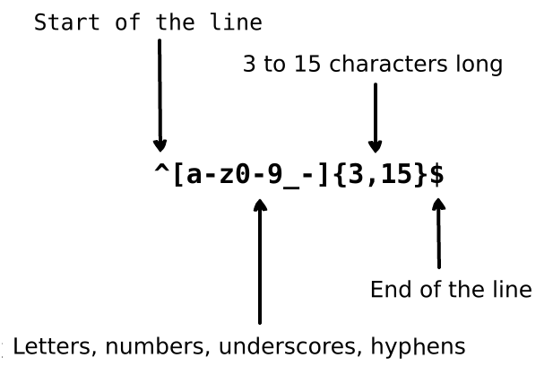

# Basic syntax

In this section, we'll cover the basic syntax of regular expressions.

## Literal characters

The simplest form a regular expression can take is a plain text string without any special characters. This will match each of the literal characters in the string exactly. When reading regular expressions, it's helpful to read them according to the _meaning_ of each character, not what we usually call the character. For example, `tune` will match a literal t, a literal u, a literal n, and a literal e. `tune` will match:

> **tune**
> 
> at**tune**d
>
> for**tune**
>
> inoppor**tune**

Matches are case sensitive by default. For example, the pattern `tune` represents only the first, lowercase, instance of this word in the following string:

> Humming a **tune** as you work can improve your mood. Tune is another word for song.

In other words, the second instance of the word "Tune" will **not** be matched because it is uppercase, and the search pattern was `tune` rather than `Tune`.

If you wanted to find  _both_ `tune` and `Tune`, you could either turn off case sensitive matching (see later in this workshop), or use a different pattern, such as `[Tt]une` to match both capital `T` and lowercase `t` in the text. We'll cover what square brackets mean in a minute.

Any string of letters and/or numbers that doesn't contain metacharacters will be interpreted literally in a regular expression.

## Metacharacters

What are metacharacters, then? They're characters (or **tokens**) that have special meaning when used in regular expressions:

`.` | Period matches any single character, except a newline.
`*` | Matches as many of the preceding token as possible (including 0) (greedy).
`+` | Matches 1 or more repetitions of the preceding token.
`?` | Matches 0 or 1 of the preceding token (makes the preceding token optional).
`[]` | Creates a character class. Matches a single character contained between the square brackets. For example, above, we wrote '[Tt]une' which matches for both 'Tune' and 'tune'.
`[^]` | Creates a negated character class. Matches a single character that is **not** contained between the square brackets.
`[a-z]` | Square brackets can also be used for ranges. This range says match any character in the range 'a-z'. This can also be done with numbers, for example '0-9'.
`[^a-z]`  | Similarly, ranges can be negated as well.
`{x}` | Curly braces. This will match exactly x number of the preceding character. For example 'a{3}' matches exactly 3 of a.
`{x,}` | Curly braces. This will match n or more times of the preceding character. For example, 'a{3,}' will match 3 or more times of a.
`{n,m}` | Curly braces. These match at least n but not more than m times of the preceding character. For example, '{1,3}' will match at least 1 time but not more than 3 times.
`(xyz)` | Character group. Matches the characters xyz in that exact order.
`|` | Alternation. Matches either the characters before or the characters after the token (if both are found, both will be matched).
`\` | Escapes the next character. This allows you to make metacharacters become literal characters (for example, '\?' will match a literal question mark).
`^` | Matches the beginning of a line.
`$` | Matches the end of a line.

Metacharacters can be combined, too. For example, `.` matches any character except a newline, once. `.+` will match any character except a newline, as many times as possible, but at least once.

## Examples 

Example 1
{: .label .label-green}

Matching on `tune|bag` (literal t, u, n, e, and/or (alternation), literal b, a, g):

> The gar**bag**eman hoisted another heavy **bag**, whistling a familiar **tune** as he worked. He was keenly at**tune**d to the rhythm of the city, even at this early hour. However, an inoppor**tune** moment arrived when several **bag**els and a wilted cab**bag**e tumbled from the **bag**, scattering across the pavement. He chuckled, realizing he didn't have much for**tune** this morning.

[Test it out here!](https://regex101.com/r/HR4ZTM/1)

Example 2
{: .label .label-green}

Sometimes American spellings and Canadian spellings of words are mixed up in one text, or perhaps in a search, you'd like to be able to match both versions in one go.

Matching on `colou?r|favou?rite` (literal c, o, l, optional u, literal r, and/or literal f, a, v, o, optional u, literal r, i, t, e):

> Lena’s **favourite** **color** had always been purple, but the rich green of the forest called to her in a way she couldn't ignore today. As she sat quietly among the trees, she noticed how the light played with the different **colour**s of the leaves, each one more vibrant than the last. It was in that moment that she decided the forest’s **color**s would always be her **favorite** sight, no matter the season.

[Test it out here!](https://regex101.com/r/uJMM3w/1)

Example 3
{: .label .label-green}

Image from [Learn Regex the Easy Way](https://github.com/ziishaned/learn-regex/blob/master/img/regexp-en.png))

This regular expression matches any text that is:

- anchored to the start of a line
- contains any of the letters `a-z`, the numbers `0-9`, underscores, and/or hyphens
- 3 to 15 characters long
- anchored at the end of the line

In the following text, this will match:

> **john_doe**
>
> **jo-hn_doe**
>
> **john12_as**

but not:

> Jo

[Test it out here!](https://regex101.com/r/H25lpZ/2) 

This is a common regex to search for usernames (though, capital A-Z is often also permitted, but is omitted here). Try out some other possible usernames or phrases to see what matches or doesn't match.