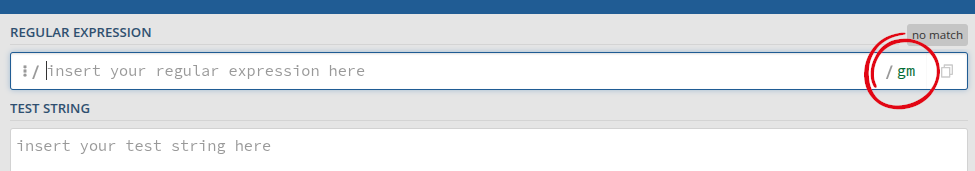

# Additional syntax
In this section, we'll take a look at some more in depth syntax.

## Shortcuts

There are some regular expressions that are used so frequently that there are shortcuts for them:

`\w` | Shortcut for any word character: any letter, digit, or underscore, [a-zA-Z0-9_].
`\W` | Any non-word character: anything **except** [a-zA-Z0-9_].
`\d` | Any digit: [0-9].
`\D` | Any non-digit: anything **except** [0-9].
`\s` | Any whitespace character: any space, tab, or newline.
`\S` | Any non-whitespace character: anything **except** any space, tab, or newline.
`\n` | Matches a newline.
`\N` | Matches anything but a newline.
`\r` | Matches a carriage return.
`\t` | Matches a tab.

There are additional shortcuts but these are a good place to start. These are useful because they save you time typing out regular expressions that you'll likely use often.

## Lookarounds

Lookarounds - lookaheads and lookbehinds - are particularly useful. They do what they say on the tin - they look ahead of your regular expression, or they look behind it. Let's take a closer look. There are four types:
 
 

Positive lookahead
{: .label .label-green}

`(?=...)` | Positive lookahead. The given pattern can be matched only if the string provided in the positive lookahead is present after the pattern (ahead of the pattern).

For example, `cat(?=house)` will match:

> **cat**house

but not

> catastrophe

 

Negative lookahead
{: .label .label-green}

`(?!...)` | Negative lookahead. The given pattern can be matched only if the string provided in the negative lookahead is **not** present after the pattern (ahead of the pattern).

For example, `cat(?!house)` will match:

> **cat**astrophe

but not

> cathouse

 

Positive lookbehind
{: .label .label-green}

`(?<=...)` | Positive lookbehind. The given pattern can be matched only if the string provided in the positive lookbehind is present before the pattern (behind the pattern).

For example, `(?<=house)cat` will match:

> house**cat**

but not

> alleycat

 

Negative lookbehind
{: .label .label-green}

`(?<!...)` | Negative lookbehind. The given pattern can be matched only if the string provided in the negative lookbehind is **not** present before the pattern (behind the pattern).

For example, `(?<!house)cat` will match:

> alley**cat**

but not

> housecat

 

Lookaheads and lookbehinds can be a little confusing to wrap your head around initially, but they are extremely powerful for being able to match strings in specific situations, so they are well worth the effort.

## Flags

If you're using regex with a programming language, it's important to enclose your regular expression within the correct characters. For example, `tune` in Python needs to be enclosed like this: `"tune"`. In Javascript or PHP, it should be `/tune/` and other programming languages may use other characters. The enclosing characters tell the programming language that what's inside is a regular expression.

Flags, also known as modifiers, come after the regular expression (outside of the double quotation marks or slashes) and affect the entire regular expression. They can be used in any order or combination.

`i` | Case insensitive: makes the match case insensitive
`m` | Multiline: anchor metacharacters work on each line
`g` | Global search: find all matches, don't stop after just the first

**Example**

`"tune"` will match:

> Humming a **tune** as you work can improve your mood. Tune is another word for song.

`"tune"ig` will match:

> Humming a **tune** as you work can improve your mood. **Tune** is another word for song.

In this example we used both the case insensitive and global search flags to, one, match regardless of case, and two, to search the entire string beyond the first match.

When testing regular expressions using [regex101.com](https://www.regex101.com), flags are present at the top of the page:

## Greedy and lazy matching

Regular expressions perform greedy matching by default, meaning that the match will continue as long as possible based on the expression provided. By adding a `?` after the quantifier, the match will become lazy, meaning to match as little as possible. For example:

`.*ne` will match:

> **Humming a tune as you work can improve your mood. Tune** is another word for song.

`.*?ne` will match:

> **Humming a tune** as you work can improve your mood. Tune is another word for song.