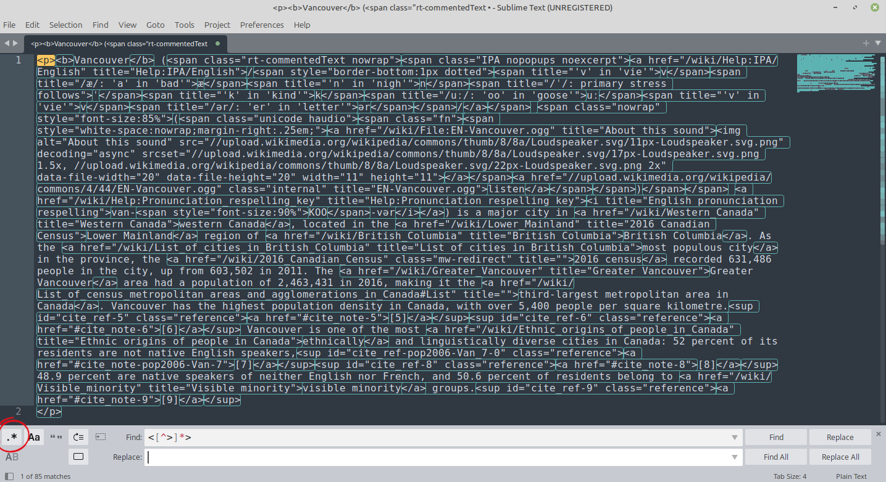

# Finding and replacing text

Now that we have a handle on the syntax, let's apply that by looking at some more complicated examples.

Example 1
{: .label .label-green}

Here's a situation where regex would be useful to manipulate text.

You have a 100 page text document and you've realized that, throughout, there are words that have three, or four, or more 'a's in a row. You'd like to cut these down to the correct number of 'a's (one), but your document also has the name 'Isaac' in it, which you'd like to leave alone. You don't want to go through all 100 pages manually. How do you find and correct the typos?

**Answer:**

Matching on: `(?<![Ii]s)a{2,}`

This regex has a negative lookbehind: `(?<!...)`. It means that the pattern you give after (in our case, `a{2,}`) will not match if what comes before it in your text is in the negative lookbehind, but will match otherwise. In other words, we are preventing matches if the content of the negative lookbehind is found before `a{2,}`.

So, this regular expression says: match every instance of 2 or more 'a's, except where 'Is' or 'is' appears before those 'a's. We accounted for instances where the name 'Isaac' might not be capitalized. Using this regular expression, here's what would match:

> Lorem ipsum dolor sit **aa**met, consectetur **aaa**dipiscing elit, Isaac sed do eiusmod tempor incididunt ut labore et dolore magn**aaa** aliqua. Ut enim ad minim veni**aaaa**m, quis nostrud exercitation ullamco laboris nisi ut aliquip ex ea commodo consequat, isaac. Duis **aaaaaa**ute irure dolor in reprehenderit in voluptate velit esse cillum dolore eu fugiat null**aaaa** pariatur. Isaac excepteur sint occaecat cupidatat non proident, sunt in culp**aa** qui officia deserunt mollit anim id est laborum.

You can then choose to replace all of these multiple 'a's with single 'a's.

[Test it out here!](https://regex101.com/r/QUiHLd/1)

While having multiple 'a's may not be so common, it is incredibly common to need to fix typos or other errors en masse or to need to find very specific strings in a large amount of text. For example, encoding errors are common and sometimes can't be fixed at the source and need to be modified by hand... or in our case, with regular expressions!

 

Example 2
{: .label .label-green}

Though our examples so far have been mostly word-based, regex is just as good with digits. Here's the scenario: you have a block of text with a number of ISBNs included, and you need to be able to isolate these ISBNs to pull them for a search later on. These ISBNs are either 10 or 13 digits, and some of them are only digits, but some of them have some hyphens, and some have many hyphens:

> The new bestseller, with its thought-provoking narrative, can be found under the ISBN 978-0-321-76572-3. If you're searching for the classic edition, look for 0123456789. This highly anticipated sequel is arriving soon, listed with the ISBN 9781234567890. I just finished reading another incredible book, its unique identifier is 0-7432-7356-7. For anyone interested in the updated academic text, the reference is 978-0-13-215881-6. The children's picture book, a delightful read, has the ISBN 0439023521. I finally tracked down that rare first edition; its ISBN is 9781234567890. The publisher recently re-released a series of novels, starting with 0-06-093546-9. You can pre-order the collector's edition using the ISBN 978-1-234-56789-0. My local library just acquired a fascinating new title, cataloged as 0071353986.

How might you match all of these?

**Answer:**

Matching on: `(?:-?\d){10,13}`

The brackets create a group and the `?:` make it into a non-capturing group (prevents some of the numbers being captured when we don't need them). Then we have an optional hyphen followed by a digit, matching that pattern at least 10 and up to 13 times. This accounts for all the ISBNs:

> The new bestseller, with its thought-provoking narrative, can be found under the ISBN **978-0-321-76572-3**. If you're searching for the classic edition, look for **0123456789**. This highly anticipated sequel is arriving soon, listed with the ISBN **9781234567890**. I just finished reading another incredible book, its unique identifier is **0-7432-7356-7**. For anyone interested in the updated academic text, the reference is **978-0-13-215881-6**. The children's picture book, a delightful read, has the ISBN **0439023521**. I finally tracked down that rare first edition; its ISBN is **9781234567890**. The publisher recently re-released a series of novels, starting with **0-06-093546-9**. You can pre-order the collector's edition using the ISBN **978-1-234-56789-0**. My local library just acquired a fascinating new title, cataloged as **0071353986**.

[Test it out here!](https://regex101.com/r/MgOkK2/2)

# Hands on exercises

In this part of the workshop, we'll be doing some hands-on exercises to give you some real experience working with regular expressions.

If you haven't already downloaded the repository files, please do so by clicking [here](https://github.com/ubc-library-rc/intro-regex/archive/refs/heads/main.zip). Navigate to the _data_ folder for this section.

## Postal codes 

In the file 'postal.txt', we find a list of what seem to be postal codes interspersed within strings of letters and numbers that look like postal codes, but are actually gibberish. We'd like to be able to match all of the gibberish lines so that we can delete them. This list is 553 lines long, so it's too long to do by hand. How might we match only the gibberish? Give it a shot yourself before we discuss.

**Answer:**

Taking a look at the list, it seems that the postal codes are the only strings that have a space in them. So, the pattern we need to match is: any 3 characters, followed by _not_ a space, followed by any 3 characters.

Matching on: `.{3}[\S].{3}`

> **QJMJ5TN**
> 
> **XJUEMLC**
>
> **8JOANNN**
>
> **0FIIIA1**
>
> **QXZN03D**
>
> WAM 4BI
>
> R0A 0S0
>
> **XUNFEAD**
>
> **2KLDUOC**
>
> RHG NMK
>
> **M0P0XQS**
>
> **D4J8MMC**

This is just a small sample of the lines in the text file, but you can see that only the gibberish lines have been matched. We can also note that this isn't the only regular expression that would work, for example `.{3}[^\s].{3}` is equivalent, and there are also other solutions. This is common for regex!

[Test it out here!](https://regex101.com/r/RDWI50/1)

## Vancouver wiki

Using regular expressions to work with HTML is contentious, as hinted at on our introduction page to this workshop:

(Image from [Stack Overflow](https://stackoverflow.com/a/1732454))

Despite this quote being partially a joke, it's getting at a truth which is that regular expressions can't account for all the variations, or contexts, of HTML.

(Image from [Reddit](https://www.reddit.com/r/AskProgramming/comments/12k2t02/eli5_why_cant_regex_parse_html/))

 Therefore, writing regex to parse *any given* HTML input is impossible. That said, if you have a small amount of *known* HTML, it is possible to use regular expressions to clean it up.

In the file 'vancouver-wiki.html.txt', we find a bunch of HTML code. It's pretty hard to read the way it is, and we'd like to clean it up so that the HTML code is removed and we're left with only the content text. There's another text file called 'vancouver-wiki.txt' that's already been cleaned up; this is what we're aiming at. Give cleaning the text up a shot before we discuss.

**Answer:**

Taking a look at the code, we need to match everything that comes in between '<' and '>'. The characters in between '<' and '>' can be basically any character, so let's try:

Matching on: `<(.)*>`

[Test it out here!](https://regex101.com/r/HEoiu2/1)

Oh no. That doesn't get us what we want at all, that matches **all** the text. It does that because if it can match on any character, unlimited times beween '<' and '>', it will just match the first '<' and very last '>'. So, we need to make it so that the pattern can't ever match a '>' in between '<' and '>', but it can match any other character. So we can match '<', negate '>' and match that character unlimited times, and then match '>'.

Matching on: `<[^>]*>`

[Test it out here!](https://regex101.com/r/AxU50N/1)

That works like we wanted! All of the HTML tags are matched while the content text is left alone. This regular expression could be used with some Python code, for example, to then remove everything that's matched. For our purposes, however, you can simply do a find and replace on the text in your favourite text editor using the regular expressions function ([Sublime Text](https://www.sublimetext.com/) or [Notepad++](https://notepad-plus-plus.org/) are both excellent choices).

Open the find and replace function, put your regular expression in the "Find" search bar, select the regular expressions option (circled in red) and leave the "Replace" search bar empty. Click "Replace All" and you'll get your cleaned up text.

## Bike racks

In the file 'bike-racks.csv', there is a long list of addresses in Vancouver where there are bike racks installed. We'd like to find out which of these addresses have 5 bike racks installed using regular expressions. How would you do this? Give it a shot before we discuss.

**Answer:**

While there are many ways to solve this with or without using regular expressions, here's one way of doing it with regular expressions. Working with the comma-separated values in a text editor instead of in a spreadsheet, we need to match the address, including the first comma, but only if the number of racks installed is 5. Sounds like a positive lookahead is going to help here.

The easiest way to figure this out is to do it in pieces, so first, let's make sure we can match just the address, regardless of what comes after. The addresses are anchored to the start of the line, and are at least one digit, followed by a comma, followed by at least one but up to infinite letters of either case, digits, and spaces. We're accounting here for addresses that are names, like "Alexander St", as well as those that are numbers, like "W 1st Av".

Regex: `^\d+,[a-zA-Z0-9 ]+`

Using a few lines of the csv data in regex101 to test this shows us that this works.

[Test it out here!](https://regex101.com/r/OjV2RZ/1)

Great. Now let's work on the positive lookahead. Here's a reminder of the regular expression for that: `(?=...)`
In the positive lookahead, we want to account for whatever comes after the addresses we want to match. So, this will be a comma, at least one letter of either case, a comma, and the number of bike racks we're after. In this case, since our sample data we're using doesn't have any 5s, we'll use a 1, and change it later.

Regex: `,[a-zA-Z ]+,1`

We can see here that we're successfully isolating just the lines with 1 bike rack.

[Test it out here!](https://regex101.com/r/0ZQBDb/1)

Now that we have these pieces, we can put them together and test them.

Full regex: `^\d+,[a-zA-Z0-9 ]+(?=,[a-zA-Z ]*,1)`

Looks like it works just like we wanted!

[Test it out here!](https://regex101.com/r/LcBGux/1)

Now we can try it on the entire csv file. Open bike-racks.csv in your text editor of choice. You can either copy the data into regex101 or work with it in the text editor. Open the find menu, make sure to enable regular expressions matching, and enter our regular expression. Don't forget to change the 1 to a 5!

[Test it out here!](https://regex101.com/r/EWvOl8/1)

You can see that the highlighted address is 1 of 12 matches found (see bottom of the screenshot), which is the correct number!

This isn't a programming workshop, so we won't go into details about this, but if you knew a bit of coding and wanted to use this information, you would now be able to pull these matches and then clean up them up so you had a tidy list of 12 addresses to work with. Regular expressions are extremely useful on their own, and even more powerful with a bit of programming knowledge - just a peek into what's possible now that you know the basics of regex.

 

Congratulations! You've made it to the end of the workshop. On the next page you'll find some helpful resources, tools, and more ways to improve your regex skills. Of course, if you have any further questions, you can always get in touch with the Digital Scholarship team at [digital.scholarship@ubc.ca](mailto:digital.scholarship@ubc.ca). Thanks for attending!